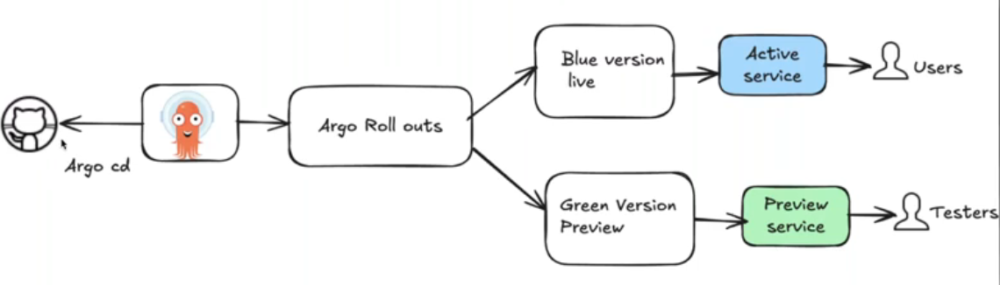

# Argo CD
Argo CD is a GitOps continuous delivery tool that automatically syncs Kubernetes resources from Git to the cluster.

## Why ArgoCD

- **Existing problems**:
    - I have a team of 6 memebers
    - I have my EKS Cluster
    - I have 4 replicas of the Pods running
    - I need to scale up my workload to 8 running Pods
        - I can by doing the "kubectl scale" command
    - This is the manual deployment
    - whatever is in my Git need to be the same in my K8s cluster
    - Deploying new version in the 2nd K8s cluster. (maintaining 2 cluster increase budget)

- **there is a multiple CI/CD tools in the market such as**:
    - Jenkins
    - Rancher
    - Gitlab
    - ...
- **Argo Cd is solving multiple problems such as**:
    - 


## DevOps/Kubernetes Objects used here

- **Git**: Acts as the single source of truth for GitOps. All Kubernetes manifests and configurations are stored and version-controlled in Git repositories.
- **EKS (Elastic Kubernetes Service)**: AWS-managed Kubernetes cluster used to deploy and run workloads at scale.
- **Pod**: The smallest deployable unit in Kubernetes. A pod encapsulates one or multiple tightly coupled containers sharing network and storage resources.
- **Deployment**: A Kubernetes object that manages stateless applications. It ensures the desired number of identical Pods (replicas) are running and handles rolling updates/rollbacks.
- **Namespace**: Logical partition inside a Kubernetes cluster used to isolate and organize resources for better management, security, and multi-tenancy.
- **YAML Syntax**: Declarative configuration format used to define Kubernetes objects. Supports lists, key-value pairs, and structured hierarchical data.
- **Helm**: Kubernetes package manager used to deploy, version, and manage applications using charts (templated YAML files).
- **Argo CD**:	GitOps continuous delivery tool that automatically syncs Kubernetes resources from Git to the cluster.
- **ConfigMap**:	Stores non-sensitive configuration data for applications running in Pods.
- **Secret**:	Stores sensitive data (passwords, keys, tokens) in base64-encoded form for secure use in Pods.
- **Service**:	Provides stable networking and load-balancing for Pods. Exposes applications inside or outside the cluster.
- **Ingress**:	Manages external HTTP/HTTPS access to applications through rules and an ingress controller.
- **CRD**: (Custom Resource Definition)	Extends Kubernetes with new resource types used by tools like Argo CD, Helm, and operators.

[Go to B01 EKS Architecture and Terraform Code](./b01_EKS/README.md)


[Go to B02 EKS Architecture and Terraform Code](./b02_EKS_Cluster/README.md)

## Blue-Green Deployment

- Install Ingress Controller

```sh
kubectl apply -f https://raw.githubusercontent.com/kubernetes/ingress-nginx/controller-v1.10.0/deploy/static/provider/aws/deploy.yaml

$ kubectl apply -f https://raw.githubusercontent.com/kubernetes/ingress-nginx/controller-v1.10.0/deploy/static/provider/aws/deploy.yaml
namespace/ingress-nginx created
serviceaccount/ingress-nginx created
serviceaccount/ingress-nginx-admission created
role.rbac.authorization.k8s.io/ingress-nginx created
role.rbac.authorization.k8s.io/ingress-nginx-admission created
clusterrole.rbac.authorization.k8s.io/ingress-nginx created
clusterrole.rbac.authorization.k8s.io/ingress-nginx-admission created
rolebinding.rbac.authorization.k8s.io/ingress-nginx created
rolebinding.rbac.authorization.k8s.io/ingress-nginx-admission created
clusterrolebinding.rbac.authorization.k8s.io/ingress-nginx created
clusterrolebinding.rbac.authorization.k8s.io/ingress-nginx-admission created
configmap/ingress-nginx-controller created
service/ingress-nginx-controller created
service/ingress-nginx-controller-admission created
deployment.apps/ingress-nginx-controller created
job.batch/ingress-nginx-admission-create created
job.batch/ingress-nginx-admission-patch created
ingressclass.networking.k8s.io/nginx created
validatingwebhookconfiguration.admissionregistration.k8s.io/ingress-nginx-admission created
```




- **Create a repositry name argo-rollout-guestbook-blue-green and clone it into local**
- **Create a file name guestbook-rollout.yaml with ** guestbook-rollout folder ** with the below code**
    - Kubernetes Argo Rollout manifest using the Blue-Green deployment strategy.

        - Kubernetes Argo Rollout manifest (**Rollout Resource**)

```yaml
# ---------------------------------------------------------------------------------------
# --This manifest defines a basic rollout for the guestbook UI app.----------------------
# --Pods are ready only after passing the readiness probe.-------------------------------
#   --Missing part: ---------------------------------------------------------------------
#       -- Deployment strategy (blueGreen or canary) is not included here; --------------
#       -- the rollout will default to Recreate strategy if no strategy is specified. ---
# ---------------------------------------------------------------------------------------
apiVersion: argoproj.io/v1alpha1    # API version for Argo Rollouts (alpha-level features)
kind: Rollout # Rollout is an Argo CD custom resource for deploying apps with advanced deployment strategies like Blue-Green or Canary.
metadata:
  name: guestbook-ui        # Unique name of the rollout in the namespace.
  namespace: default        # Kubernetes namespace where this rollout will be applied.
spec:
  replicas: 3               # Desired number of pod replicas  -  Launches 3 pods for my app
  revisionHistoryLimit: 2   # Keeps only the last 2 revisions for rollback purposes; older versions are cleaned up.
  selector:             # Selects which pods belong to this rollout based on the label app: guestbook-ui.
    matchLabels:        # Must match the labels in template.metadata.labels to ensure proper association.
      app: guestbook-ui
  template:     # Pod Definition
    metadata:
      labels:   # Labels assigned to pods; must match the selector.
        app: guestbook-ui
    spec:
      containers:   # Defines container specifications.
        - name: guestbook-ui
          image: udemykcloud534/guestbook:green # Docker image used.
          imagePullPolicy: Always   # Always pull the latest version of this image - Ensures the image is pulled every time the pod starts.
          ports:
            - containerPort: 8080   # Exposes port 8080 from the container - Exposes container port for the service.
          readinessProbe:           # Ensures pods are healthy before they receive traffic. (Checks if the pod is ready to receive traffic.) [This ensures only healthy pods are added to the service endpoint.]
            httpGet:
              path: /       # Probe checks the root endpoint
              port: 8080
            initialDelaySeconds: 5  # Wait 5 seconds after container starts before first check.
            periodSeconds: 10       # Check every 10 seconds.
  strategy:
    blueGreen:                                      # Use the Blue-Green deployment strategy
      activeService: guestbook-ui                   # Service pointing to the active (live) version
      previewService: guestbook-ui-blue-green       # Service used to preview the new version
      autoPromotionEnabled: false                   # Requires manual promotion after verification
      scaleDownDelaySeconds: 300                    # Delay before scaling down old ReplicaSet (5 minutes)
---
```

    - Kubernetes Service

```yaml
apiVersion: v1  # This is a standard Kubernetes API version used for core resources like Services, Pods, ConfigMaps, etc.
kind: Service   # This resource exposes a set of Pods as a network service. (In this case, it exposes the guestbook-ui application so users or other services can access it.)
metadata:
  # This name is important because Argo Rollouts will use this service as the activeService when doing Blue-Green deployments.
  name: guestbook-ui # The service name will be guestbook-ui.
  namespace: default # The service lives in the default namespace.
spec:           # Service Specification
  # Port Mapping
  # Clients send traffic to port 80, but the service forwards it to the container's 8080.
  ports:
    - port: 80          # The port the Service exposes inside the cluster (ClusterIP port).
      targetPort: 8080  # The port on the container/pod where your application listens.
  selector: # This connects the Service to Pods based on labels.
    app: guestbook-ui
```

    - guestbook-ui-blue-green Service used in the Argo Rollouts Blue-Green deployment.
```yaml
apiVersion: v1
kind: Service
metadata:
  name: guestbook-ui-blue-green # Name of the service used as the "previewService" in the Blue-Green strategy.
  namespace: default            # This service will be created in the default namespace.
spec:
  ports:
    - port: 80          # The service exposes port 80 externally.
      targetPort: 8080  # Traffic received on port 80 is forwarded to port 8080 inside the pod.
  selector:
    app: guestbook-ui   # The service routes traffic to pods with the label app=guestbook-ui.
```

    - Ingress manifest for the guestbook-ui application:
```yaml
# Ingress is used to expose your application externally (using HTTP/HTTPS) via an Ingress Controller — in this case, NGINX.
# The annotation and ingressClassName both ensure the NGINX Ingress Controller processes this resource.
# The Ingress forwards all traffic (/) to the guestbook-ui service.
# Since this is your activeService in a Blue-Green deployment:
    # Production traffic always goes to the stable version connected to the guestbook-ui service.
# The preview version (guestbook-ui-blue-green) is not exposed publicly, unless you choose to create a second Ingress for it.
apiVersion: networking.k8s.io/v1
kind: Ingress
metadata:
  name: guestbook-ui-ingress    # Name of the Ingress resource.
  namespace: default            # Ingress will be created in the default namespace.
  annotations:
    kubernetes.io/ingress.class: "nginx"    # Tells Kubernetes to use the NGINX Ingress Controller.
spec:
  ingressClassName: nginx       # Specifies that this Ingress should be handled by the nginx controller.
  rules:
    - http:                     # Defines HTTP routing rules.
        paths:
          - path: /             # All traffic going to domain/* is matched.
            pathType: Prefix    # Prefix match means "/anything" will match this rule
            backend:
              service:
                name: guestbook-ui  # The destination service (active service).
                port:
                  number: 80        # The service port where traffic will be forwarded.
```

## Create Application

- creating a file named application.yaml and making sure to verify repoURL matches the repositry which I cloned above.

    - Argo CD Application manifest:
```yaml
apiVersion: argoproj.io/v1alpha1
kind: Application   # This tells Kubernetes it is an Argo CD Application, not a Deployment/Service/etc.
metadata:
  name: guestbook-rollout   # The application is named guestbook-rollout
  namespace: argocd         # It is created in the argocd namespace (where Argo CD runs)
spec:
  project: default  # This application belongs to the default Argo CD project.
  source:
    repoURL: https://github.com/crazylearning-cr/argo-rollout-guestbook-blue-green.git  # GitHub repository that contains my manifests
    path: guestbook-rollout # Directory inside the repo where Kubernetes YAML is located
    targetRevision: HEAD    # Branch/tag to use (HEAD = latest version of default branch)
  destination:  # This tells Argo CD where to deploy the application:
    server: https://kubernetes.default.svc  # Kubernetes cluster where Argo CD is running
    namespace: default  # In the default namespace
  syncPolicy:
    automated: {}
```
- Apply the application.yaml

```sh
kubectl apply -f application.yaml

$ kubectl apply -f application.yaml
application.argoproj.io/guestbook-rollout created

```


