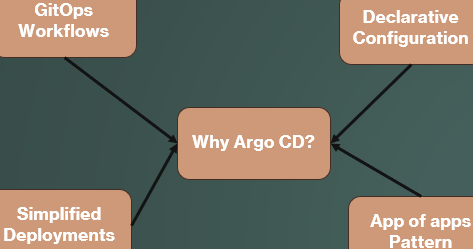
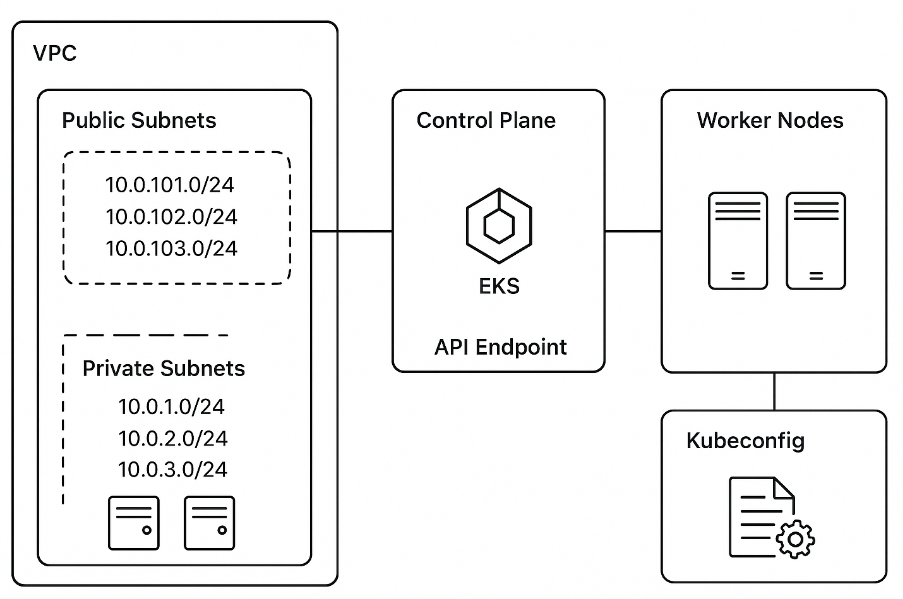

# Argo CD
Argo CD is a GitOps continuous delivery tool that automatically syncs Kubernetes resources from Git to the cluster.

## Why ArgoCD

- **Existing problems**:
    - I have a team of 6 memebers
    - I have my EKS Cluster
    - I have 4 replicas of the Pods running
    - I need to scale up my workload to 8 running Pods
        - I can by doing the "kubectl scale" command
    - This is the manual deployment
    - whatever is in my Git need to be the same in my K8s cluster
    - Deploying new version in the 2nd K8s cluster. (maintaining 2 cluster increase budget)

- **there is a multiple CI/CD tools in the market such as**:
    - Jenkins
    - Rancher
    - Gitlab
    - ...
- **Argo Cd is solving multiple problems such as**:
    - 

## DevOps/Kubernetes Objects used here
- **Git**: Acts as the single source of truth for GitOps. All Kubernetes manifests and configurations are stored and version-controlled in Git repositories.
- **EKS (Elastic Kubernetes Service)**: AWS-managed Kubernetes cluster used to deploy and run workloads at scale.
- **Pod**: The smallest deployable unit in Kubernetes. A pod encapsulates one or multiple tightly coupled containers sharing network and storage resources.
- **Deployment**: A Kubernetes object that manages stateless applications. It ensures the desired number of identical Pods (replicas) are running and handles rolling updates/rollbacks.
- **Namespace**: Logical partition inside a Kubernetes cluster used to isolate and organize resources for better management, security, and multi-tenancy.
- **YAML Syntax**: Declarative configuration format used to define Kubernetes objects. Supports lists, key-value pairs, and structured hierarchical data.
- **Helm**: Kubernetes package manager used to deploy, version, and manage applications using charts (templated YAML files).
- **Argo CD**:	GitOps continuous delivery tool that automatically syncs Kubernetes resources from Git to the cluster.
- **ConfigMap**:	Stores non-sensitive configuration data for applications running in Pods.
- **Secret**:	Stores sensitive data (passwords, keys, tokens) in base64-encoded form for secure use in Pods.
- **Service**:	Provides stable networking and load-balancing for Pods. Exposes applications inside or outside the cluster.
- **Ingress**:	Manages external HTTP/HTTPS access to applications through rules and an ingress controller.
- **CRD**: (Custom Resource Definition)	Extends Kubernetes with new resource types used by tools like Argo CD, Helm, and operators.

[Go to B01 EKS Architecture and Terraform Code](./b01_EKS/README.md)

[Go to B02 EKS Architecture and Terraform Code](./b02_EKS_Cluster/README.md)

