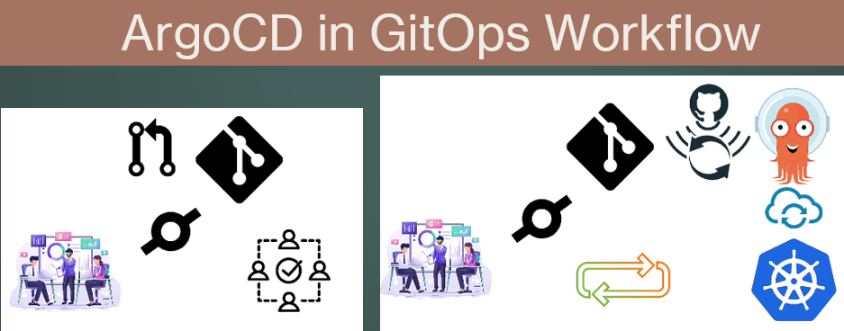

# GitOpsWithArgoCD

Argo CD and GitOps: Helm, Kustomize, ApplicationSets, Blue/Green, CI/CD, Plugins, Hooks and many more!

## GitOps

- GitOps is:

  - A set of practices that laverage Git as the single source of truth for declarative infrastructure and application configurations
  - Enables teams to streamline their application delivery process, automate deployments, and improve collaboration
  - GitOps was coined by Weaveworks

- There are 4 principles in GitOps:

  - Declarative configuration;
  - Version Control
  - Automated synchronization
  - Continuous feedback

- Benefits of GitOps:
  - Increase productivity
  - Improved collaboration
  - Enhanced Security
  - faster Recovery

## ArgoCD

- ArgoCd is:

  - A declarative GitOps continuous delivery tool for K8s
  - Using Git as the single source of truth
  - Can manage multiple Kubernetes Clusters environment

- Key Features of ArgoCD:

  - Declarative and versioned
  - Multi cluster support
  - Automated Sync and Rollback
  - Pluggable deployment strategies
  - extensibility

- ArgoCD Architecture:
  - ArgoCD CD API Server
  - Repository server
  - Application Controller
  - ArgoCd CD CLI

- Advantaged of ArgoCD:
  - Streamlined Deployments
  - Enhanced collaboration
    = Improve security
  - Faster incident response
  - scalability
