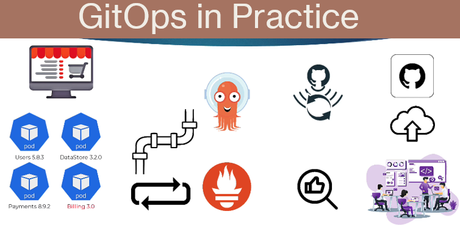

# GitOpsWithArgoCD

Argo CD and GitOps: Helm, Kustomize, ApplicationSets, Blue/Green, CI/CD, Plugins, Hooks and many more!

## GitOps

- GitOps is:

  - A set of practices that laverage Git as the single source of truth for declarative infrastructure and application configurations
  - Enables teams to streamline their application delivery process, automate deployments, and improve collaboration
  - GitOps was coined by Weaveworks

- There are 4 principles in GitOps:

  - Declarative configuration;
  - Version Control
  - Automated synchronization
  - Continuous feedback

- Benefits of GitOps:
  - Increase productivity
  - Improved collaboration
  - Enhanced Security
  - faster Recovery



## ArgoCD

- ArgoCd is:

  - A declarative GitOps continuous delivery tool for K8s
  - Using Git as the single source of truth
  - Can manage multiple Kubernetes Clusters environment

- Key Features of ArgoCD:

  - Declarative and versioned
  - Multi cluster support
  - Automated Sync and Rollback
  - Pluggable deployment strategies
  - extensibility

- ArgoCD Architecture:
  - ArgoCD CD API Server
  - Repository server
  - Application Controller
  - ArgoCd CD CLI


- Advantaged of ArgoCD:
  - Streamlined Deployments
  - Enhanced collaboration
  - Improve security
  - Faster incident response
  - scalability

## GitOps with ArgoCD
- The benefits to managed K8s based applications using GitOps with ArgoCD:
    - Tradditional deployment methods often lack the necessary automation, consistency, and reliability needed in modern environments
    - GitOps relies on Git as a single of truth for declarative infrastructure and provides a clear, version-controlled history of changes.

- **Why Choose argoCD?**
  - ArgoCD is a popular choice to implement GiytOps workflows because of the following:
    - specifically design for K8s native
    - Provide automated deployments (Automatically synchronizes the state of the applications with the desired state defined in my Git repository, reducing manual intervention and human error.)
    - Supports various configuration mangement tools.
    - Enhance Security and Compliance.
    - Facilitates collaboration and transparency.

## Installing and Configuring git
- Installing and configuring Git with the SSH authentication
  - On ubuntu:
```sh
sudo apt update
sudo apt install git -y
git --version
```

  - onfigure the git user information by running:
```sh
git config --global user.name "Arristide Tchatua"
git config --global user.email "tchattua@gmail.com"
git config --global core.editor "vim" # execute
```

  - Create an SSH key-pair:
```sh
# Generate a new SSH key using the Ed25519 algorithm with an email label
ssh-keygen -t ed25519 -C "tchattua@gmail.com"

# Start the ssh-agent in the current shell session so it can manage SSH keys
eval "$(ssh-agent -s)"

# Add the newly created private key to the ssh-agent for automatic authentication
ssh-add ~/.ssh/id_ed25519

# Display the public key so you can copy it and add it to GitHub, GitLab, or a server
cat ~/.ssh/id_ed25519.pub

# Copy the output above and paste it into the appropriate settings (GitHub/GitLab/AWS/etc.)
# The public key is safe to share, but NEVER share your private key (~/.ssh/id_ed25519)

# Copy the contents of the key
```

  - Navigate to Gitlab.com
  - Login using SSO.
  - Click on the profile icon.
  - Choose preferences.
  - Choose SSH keys from the left-hand navigation.
  - Paste the contents of the public key in the box.
  - Click add key.

## Kubernetes cluster setup on Ubuntu

- Install Docker by running the following commands:
```sh
# Update the list of available packages
sudo apt-get update

# Install required dependencies for using HTTPS repositories
sudo apt-get install -y apt-transport-https ca-certificates curl gnupg-agent software-properties-common

# Download and add Docker’s official GPG key (used to verify package integrity)
curl -fsSL https://download.docker.com/linux/ubuntu/gpg | sudo apt-key add -

# Add the official Docker repository for Ubuntu (automatically detects your Ubuntu version)
sudo add-apt-repository "deb [arch=amd64] https://download.docker.com/linux/ubuntu $(lsb_release -cs) stable"

# Update package lists again after adding the Docker repository
sudo apt-get update

# Install Docker Engine (docker-ce), Docker CLI, and containerd runtime
sudo apt-get install -y docker-ce docker-ce-cli containerd.io

# Add the current user to the 'docker' group so Docker can be run without sudo
sudo usermod -aG docker ${USER}

# Refresh the group membership without needing to reboot or log out
newgrp docker

# Check the installed Docker version (test command)
docker version
```

  - Install kubectl by runnig the following command:
```sh
# Download the latest stable version of kubectl for Linux (64-bit).
# The first curl fetches the latest version number, the second downloads the binary.
curl -LO "https://dl.k8s.io/release/$(curl -L -s https://dl.k8s.io/release/stable.txt)/bin/linux/amd64/kubectl"

# Move the downloaded kubectl binary into /usr/local/bin so it is available system-wide
sudo mv kubectl /usr/local/bin

# Make the kubectl binary executable
sudo chmod +x /usr/local/bin/kubectl

# Verify that kubectl is installed correctly and show the client version
kubectl version --client
```

  - Go to https://github.com/kubernetes-sigs/kind/releases
  - Scroll down till you find the downloadable files.
  - Right click on the Linux AMD64 and copy the link.
  - In the terminal, run the following:
```sh
# Download the Kind (Kubernetes IN Docker) binary for Linux 64-bit, version 0.30.0
wget https://github.com/kubernetes-sigs/kind/releases/download/v0.30.0/kind-linux-amd64
# Move the downloaded Kind binary to /usr/local/bin and rename it to "kind"
sudo mv kind-linux-amd64 /usr/local/bin/kind
# Make the Kind binary executable
sudo chmod +x /usr/local/bin/kind
# Verify that Kind is installed correctly by displaying the installed version
kind version
kind create cluster # don't run this command yet
```

  - Create a cluster configuration file as follows:
```yaml
# cluster.yaml
kind: Cluster
apiVersion: kind.x-k8s.io/v1alpha4
nodes:
- role: control-plane
  kubeadmConfigPatches:
  - |
    kind: InitConfiguration
    nodeRegistration:
      kubeletExtraArgs:
        node-labels: "ingress-ready=true"
  extraPortMappings:
  - containerPort: 80
    hostPort: 8080
    protocol: TCP
  - containerPort: 443
    hostPort: 8443
    protocol: TCP
```
  - Create a cluster by running the following command:
```sh
kind create cluster --config=cluster.yaml
kubectl cluster-info --context kind-kind
```

  - Load Kubernetes kernel modules
```sh
sudo modprobe overlay
sudo modprobe br_netfilter
sudo modprobe ip_tables
sudo modprobe nf_conntrack
```

  - Make modules persistent
```sh
echo -e "overlay\nbr_netfilter\nip_tables\nnf_conntrack" | sudo tee /etc/modules-load.d/k8s.conf
```

  - Add required sysctl settings
```sh
cat <<EOF | sudo tee /etc/sysctl.d/k8s.conf
net.bridge.bridge-nf-call-ip6tables = 1
net.bridge.bridge-nf-call-iptables = 1
net.ipv4.ip_forward = 1
EOF
```

  - Apply sysctl
```sh
sudo sysctl --system
```

  - RECREATE YOUR KIND CLUSTER
```sh
kind delete cluster
kind create cluster --config cluster.yaml

```

## Install ArgoCD on my cluster

- nstall Helm:
```sh
# Download and execute the official Helm installation script for Helm 3
# The script automatically detects your OS and architecture and installs Helm
curl https://raw.githubusercontent.com/helm/helm/main/scripts/get-helm-3 | bash
```

- Install Argo CD on the cluster using Helm as follows:
```sh
# Add the official Argo Helm repository so Helm can fetch Argo charts
helm repo add argo https://argoproj.github.io/argo-helm
# (Optional) Update your local Helm chart repository cache
helm repo update
# Create a Kubernetes namespace called 'argocd' to isolate Argo CD resources
kubectl create namespace argocd
# Install Argo CD into the 'argocd' namespace using Helm
# - 'argocd' is the release name
# - '-n argocd' specifies the namespace
# - 'argo/argo-cd' specifies the chart from the 'argo' repository
helm install argocd -n argocd argo/argo-cd
```

- Get the administrator password (or just copy the command from the Helm output):
```sh
kubectl -n argocd get secret argocd-initial-admin-secret -o jsonpath="{.data.password}" | base64 -d
```

- Copy the password that was brought.
- Create a port-forward to access the UI of the server by running:
```sh
kubectl port-forward service/argocd-server -n argocd 8080:443 --address="0.0.0.0"
```

- Open the browser and navigate to Public_IP_@:8080. Accept the security risk. Enter the username: admin and paste the password from the above output.
- Return back to the terminal and install the Nginx ingress controller by running the following command:
```sh
kubectl apply -f https://raw.githubusercontent.com/kubernetes/ingress-nginx/main/deploy/static/provider/kind/deploy.yaml
# kubectl wait --namespace ingress-nginx --for=condition=ready pod --selector=app.kubernetes.io/component=controller --timeout=90s
```

- Retun the Helm command enabling Ingress and the other required options:
```sh
helm upgrade argocd --set configs.params."server\.insecure"=true --set server.ingress.enabled=true  --set server.ingress.ingressClassName="nginx" -n argocd argo/argo-cd
```


